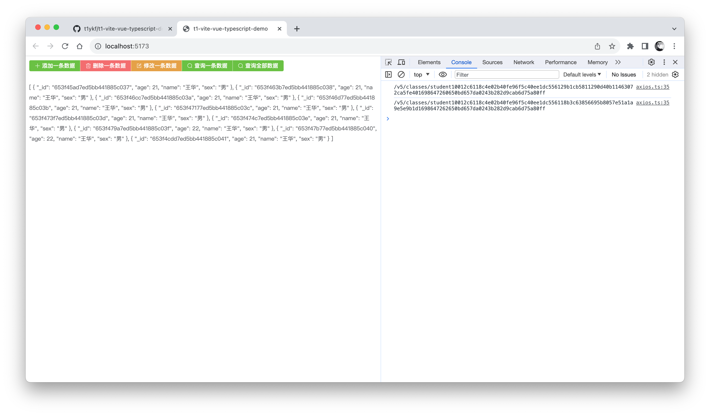

T1 后端云 Vite4+Vue3+TypeScript 例子

本文档是 T1 后端云 官方提供的 Vite4+Vue3+TypeScript 例子，方便 Web 前端 开发人员快速使用 T1 进行后端开发。


# 前期准备

## 环境变量配置

打开项目中的`.env.dev`和`.env.prod`，修改其中的 APPID 以及 API Key，Secret Key，生产环境请一定将域名替换为自己的域名！

```bash
# 您的 Application ID
VITE_APP_APP_ID = '1001'
# 您的 API Key
VITE_APP_API_KEY = '2c6118c4e02b40fe96f5c40ee1dc5561'
# 您的 Secret Key
VITE_APP_SECRET_KEY = '650bd657da0243b282d9cab6d75a80ff'
# 您的T1后端云域名（生产环境下，我建议你将域名替换为你自己的域名）
VITE_APP_T1Y_API = 'http://dev.t1y.net/api'
```

# 封装说明

在项目中的 `api` 文件夹下，封装了 `axios.ts` 以及 `api.ts`，这两个文件是核心文件，可以多阅读理解一下，在使用的时候只需要导入 `api.ts` 中的 `DataService` 类即可

-   导入 DataService 类

```typescript
import { DataService } from './api/api.ts'
```

-   创建一条数据

```typescript
const CreateOne = () => {
    DataService.CreateOne(table, data).then((res: any) => {
        // 创建成功
        // 数据唯一ID标识：res.data.objectId
        ElMessage.success(res.message)
    })
}
```

-   删除一条数据

```typescript
// 删除一条数据
const DeleteOne = () => {
    DataService.DeleteOne(table, objectID.value).then((res: any) => {
        // 删除成功
        ElMessage.success(res.message)
    })
}
```

-   修改一条数据

```typescript
const UpdateOne = () => {
    DataService.UpdateOne(table, objectID.value, { $set: { age: 22 } }).then(
        (res: any) => {
            // 修改成功
            ElMessage.success(res.message)
        },
    )
}
```

-   查询一条数据

```typescript
const ReadOne = () => {
    DataService.ReadOne(table, objectID.value).then((res: any) => {
        // 查询成功
        result.value = res.data.data
        ElMessage.success(res.message)
    })
}
```

-   查询全部数据（分页查询）

```typescript
const ReadAll = () => {
    DataService.ReadAll(table, 1, 10).then((res: any) => {
        // 查询成功
        result.value = res.data.data
        ElMessage.success(res.message)
    })
}
```
